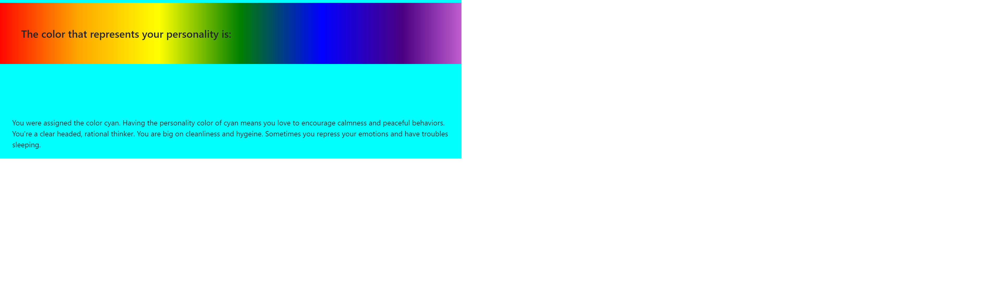

# HueAreYou <h1>Project Members:</h1> 
     Troy Freed 
     Megan Knauss 
     Madison Keller
     Vick Phat

# Contact Info :

tfreedwebdev94@gmail.com

vickphat@gmail.com

mknauss97@gmail.com

<h2>Project Drescription:</h2>

"Hue Are You?" is a quick and simple personality test to help a user find a color that matches their personality. Also, it will produce both a HEX code and an RGB code so that the user may use it to style their application.

<h2>Motivation:</h2>

To help an individual who has trouble choosing a color. The test will help find a color based off their answers in the personality test.
  
<h2>User Story:</h2>

As a user, I need help picking a color. So, I would like a quiz made that gives me a color based on my answers. When I receive my color, I would like the HEX and RGB code to show so that I may use it for my own application.

<h2>Process:</h2>
Technologies used:
    * Html
    * BootStrap
    * CSS
    * Javascript
    * Jquery

<h2>API Process:</h2>

https://www.thecolorapi.com/

https://fontawesome.com/
>
<h2>Links</h2>

Link to deployed application - https://tfreed94.github.io/HueAreYou/

Link to GitHub repo - https://github.com/tfreed94/HueAreYou

This project is liscensed under the terms of the MIT License